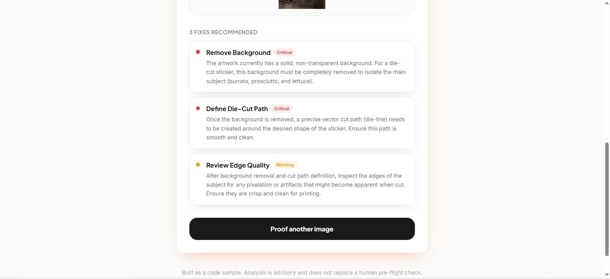
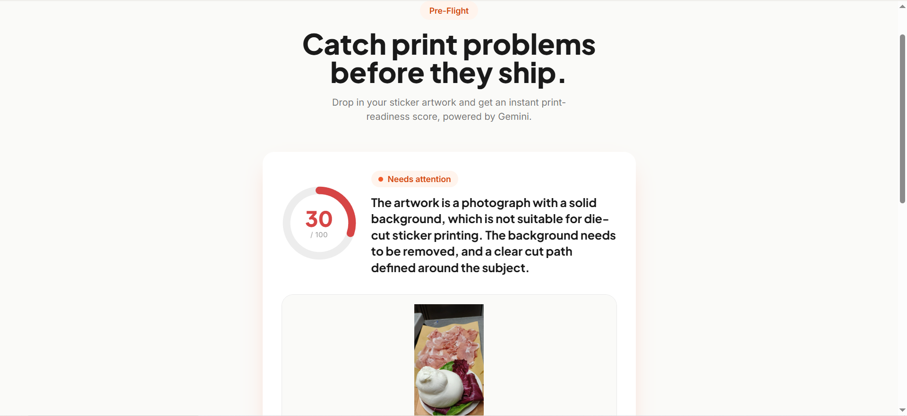
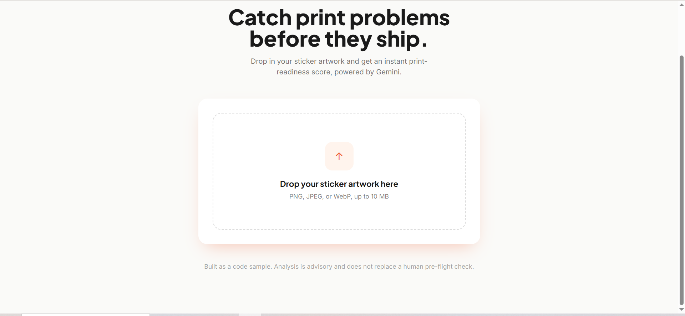

# Auto-Proofing Vision Agent

An automated pre-flight checker for sticker artwork. Drop in a logo or design and
get an instant, structured print-readiness report — a transparency check, an edge
and resolution check, a contrast check, a 0–100 score, and a prioritized list of
fixes — generated by **Gemini Vision**.

  

---

## Screenshots

**The report — a print-readiness verdict with severity-ranked, sequenced fixes:**





**The upload screen:**



---

## Why this matters for a sticker business

Every design that reaches production has to clear a pre-flight check: is the
background actually transparent, are the edges crisp enough to die-cut, will the
colors hold contrast on physical media? Today that judgment lives in the heads of
experienced production staff, and it happens *after* a customer has already
submitted and waited.

This app moves that check to the moment of upload. It catches the common,
expensive failures — flattened backgrounds, low-resolution exports, pixelated
edges, content running off the safe margin — before a file enters the print
queue. The payoff is concrete: fewer reprints, fewer support tickets, faster
turnaround, and a customer who is told exactly what to fix while they are still at
their keyboard.

It is built to slot in as a first-pass filter that escalates only genuine
ambiguity to a human, not to replace the human.

## How the AI is used

The interesting work is in turning an open-ended vision task into a **reliable,
structured signal** the product can act on:

- **Gemini Vision** inspects the raw image against an explicit, domain-specific
  print rubric (transparency, edge quality, resolution, contrast, safe margins).
- The model is constrained with a **strict JSON Schema** via `responseSchema`, so
  it returns exactly the fields the UI needs and never free-form prose.
- Every response is **validated at runtime with Zod** before it is trusted. If the
  model returns something off-rubric (e.g. an out-of-range score), the service
  **retries once**, then fails cleanly rather than rendering garbage.
- The two readiness signals are reconciled server-side so `isPrintReady` and
  `score` can never contradict each other.

The result is an LLM used as a dependable component with a hard contract, not a
chat box bolted onto a form.

The provider is isolated to a single service (`visionService.ts`), so swapping the
model behind the proofing endpoint touches one file and nothing else.

## Architecture

```text
auto-proofing-vision-agent/
├── server/                     # Node + Express + TypeScript (strict)
│   └── src/
│       ├── server.ts           # App entry, middleware, route mounting
│       ├── config.ts           # Env validation — fails fast on misconfig
│       ├── routes/proofing.ts  # HTTP + upload concerns only
│       ├── services/
│       │   └── visionService.ts# Gemini Vision call, schema, retry, validation
│       └── types/proofing.ts   # Zod schema = single source of truth
└── web/                        # React 18 + Vite + TypeScript + Tailwind
    └── src/
        ├── App.tsx             # Explicit idle → scanning → done/error state machine
        ├── components/         # Dropzone, ScanningPreview, Report
        └── lib/                # Typed API client + shared types
```

The route layer owns transport (upload parsing, status codes); the service layer
owns the AI logic. They share nothing but a typed contract, so either can be
tested or swapped independently.

## Running it locally

Requirements: Node 20+ and a Google Gemini API key.

**1. Backend**

```bash
cd server
npm install
cp .env.example .env        # add your GEMINI_API_KEY
npm run dev                 # http://localhost:3001
```

**2. Frontend** (in a second terminal)

```bash
cd web
npm install
npm run dev                 # http://localhost:5173
```

Open `http://localhost:5173` and drop in an image. The Vite dev server proxies
`/api` to the backend, so no extra configuration is needed.

## Engineering notes

- **TypeScript strict everywhere**, including `noUncheckedIndexedAccess`, on both
  sides.
- **No fake delays.** The scanning animation is a CSS sweep bound to the real
  pending state; the UI leaves it the instant the awaited request resolves.
- **Real async handling.** Upload, network, validation, and model failures each
  map to a specific status code and a user-safe message.
- **Hygiene.** Strict `.gitignore` keeps `node_modules` and every `.env` out of
  version control; secrets are validated at startup and never logged.
- **Accessibility.** Keyboard-operable dropzone, visible focus rings, `role="alert"`
  on errors, and `prefers-reduced-motion` respected via Tailwind defaults.
- **Verified.** Both packages type-check and the frontend builds for production
  with zero errors.

## Limitations and next steps

- Analysis is advisory; a model can misjudge edge cases, so this is a first-pass
  filter, not a final sign-off.
- Natural extensions: persist reports per customer, add a true DPI/resolution
  check from image metadata to complement the visual judgment, and batch-proof
  multi-file uploads.